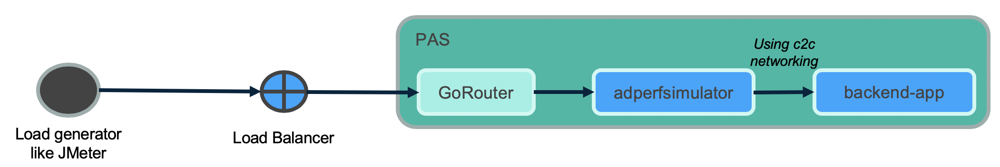
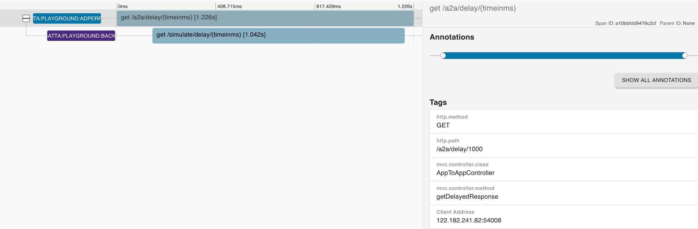

## SpringBoot with SCS on PAS ##

This is extension of [springboot-performance-simulator](https://github.com/amlandatta/springboot-performance-simulator) where same project is integrated with Pivotal Spring Cloud Services
This is to simulate performance by inducing latency, spiking memory usage, creating errors, etc and deploy on PCF (PAS).

Inspired by [Making's spring store 2019 project](https://github.com/making/spring-store-2019)

* Pre-requisite

  a. SCS 3.1.x tile

  b. Create service for Service Registry

  ```
  cf create-service p.service-registry standard ad-registry-service
  ```

  c. Deploy zipkin app (for test only, ignore this if zipkin not required and remove from manifest)

  ```
  cd zipkin
  cf push --vars-file=vars-myenv.yml
  ```

  c. Create service for Zipkin

  ```
  cf cups adzipkin -p "{\"url\": \"https://adzipkin.apps.myenv.com\" }"
  # if you plan to use internal domain then create network policies for each app to bind to zipkin
  ```

* Build & Deploy first app.

  - [vars-myenv.yml](vars-myenv.yml)

  ```
  # replace with your domain
  domain: apps.myenv.com

  # replace with your backend application name
  backend-app-name: backend-app
  ```

  - [manifest.yml](manifest.yml)

  ```
  # replace with your service-name for service registry
    services:
     - ad-registry-service
  ```

  - [application.yml](src/main/resources/application.yml)

  ```
  # check application name
  # change registrationMethod to route if external route registration is required
  spring:
    application:
      name: adperfsimulator
    cloud:
      services:
        registrationMethod: direct
  ```

  - Build

  ```
  cd springboot-with-scs
  mvn clean package -DskipTests
  ```

 - Deploy app to PAS

  ```
  cf7 push --vars-file=vars-myenv.yml
  ```

* Build and Deploy second app.
> Here same code is used to deploy two (2) different applications. `adperformance` will be configured to connect to `backend-app`



  - Replace appname in [vars-myenv.yml](vars-myenv.yml)

  ```
  app_name: backend-app
  ```

  - [application.yml](src/main/resources/application.yml)

  ```
  # check application name
  # change registrationMethod to route if external route registration is required
  spring:
    application:
      name: backend-app
    cloud:
      services:
        registrationMethod: direct
  ```

  - Build app for second app deployment

  - Deploy app to PAS

    ```
    cf7 push --vars-file=vars-myenv.yml
    ```

* Add network policy to allow container to container networking

  ```
  cf add-network-policy adperfsimulator --destination-app backend-app --protocol tcp --port 8080
  ```

- **Zipkin** Dashboard


- View inter service dependency

