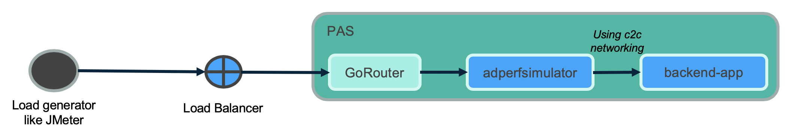
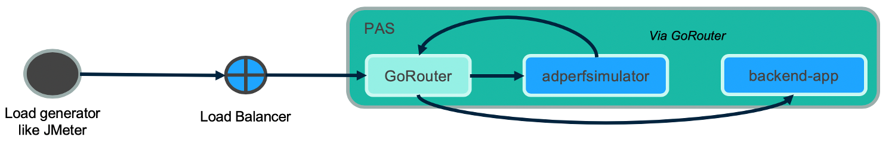

# springboot-with-scs-performance-simulator


### Rest end-points to simulate test ###


* __Simulate latency by hitting backend app via app using Internal domain (c2c networking)__

  - (1000 ms) <//adperformancesimulator.apps.myenv.com>/a2a/delay/1000

  ```
  # set registration Method as direct and add c2c network policy
  spring.cloud.services.registrationMethod=direct
  ```

  


* __Simulate latency by hitting backend app via app using External domain (Via GoRouter)__

  * (1000 ms) <//adperformancesimulator.apps.myenv.com>/a2a/delay/1000

  ```
  # set registration Method as route (default)
  spring.cloud.services.registrationMethod=route
  ```

  


* For other scenarios refer [springboot-performance-simulator](https://github.com/amlandatta/springboot-performance-simulator)

 [Back to Table of Content](README.md)
